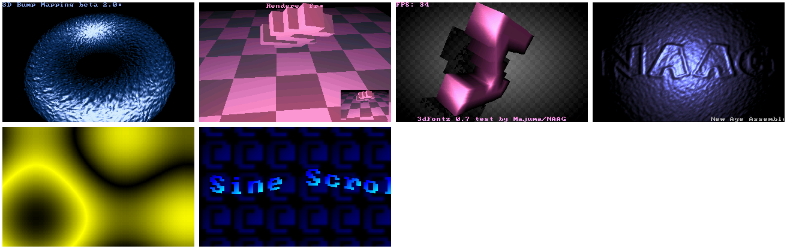

# megassembly/32

Graphical effects for MS-DOS implemented in 32-bit x86 Assembly. 

For some historical background, have a look at my
[other repository](https://github.com/efliks/demoscene-legacy).

## Build

To build and run the graphical effects, you need a PC running some 
version of DOS. It may also be a DOS VM or a DOS emulator, for example 
DosBox or PCem.

Secondly, you need 
[Borland Turbo Assembler 5.0](https://winworldpc.com/product/turbo-assembler/5x).

Once you have the assembler installed, start from building the common 
modules. Simply run make in the common folder:

```
c:\mgssmbly\common > c:\tasm\bin\make.exe -f makefile
```

Then, repeat the above for each effect. Note that the paths to TASM and TLINK 
in the makefile should match your Turbo Assembler installation folder.

## Execute

There are six executable files. Since they make use of protected mode, you
need a DOS extender. 

You can download CWSDPMI at 
[this location](https://www.ibiblio.org/pub/micro/pc-stuff/freedos/files/util/system/cwsdpmi/csdpmi7b.zip).

Unpack the archive and copy CWSDPMI.EXE into the main folder. Start 
CWSDPMI.EXE first, and immediately after start the executable of your 
choice. I know, this is inconvenient, but can be automated with 
a simple batch file.

If you are using Win9x, do not bother with CWSDPMI, because Windows has
its own DPMI facility. You can start the effects directly.

When watching an effect, press any key to exit to DOS.

## Future plans

* Implement timing based on the PC timer, not on VGA vertical retrace
* Combine the effects into one demo
* Use an embedded DOS extender
* Simplify build process
